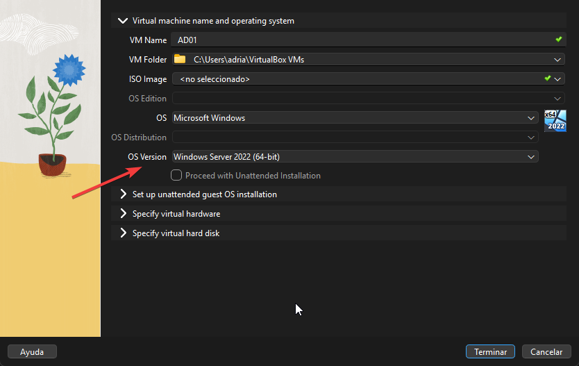
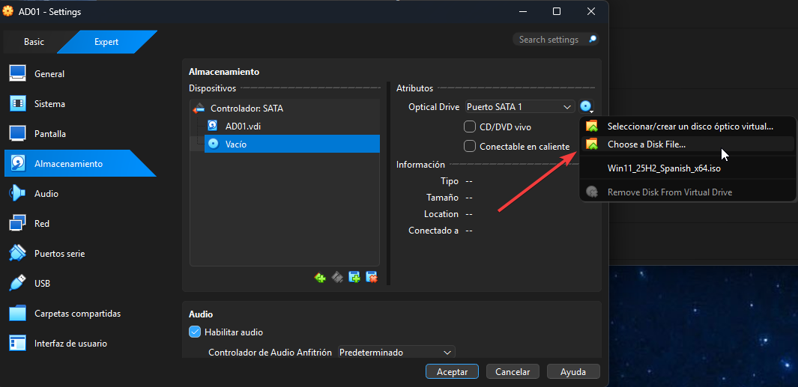
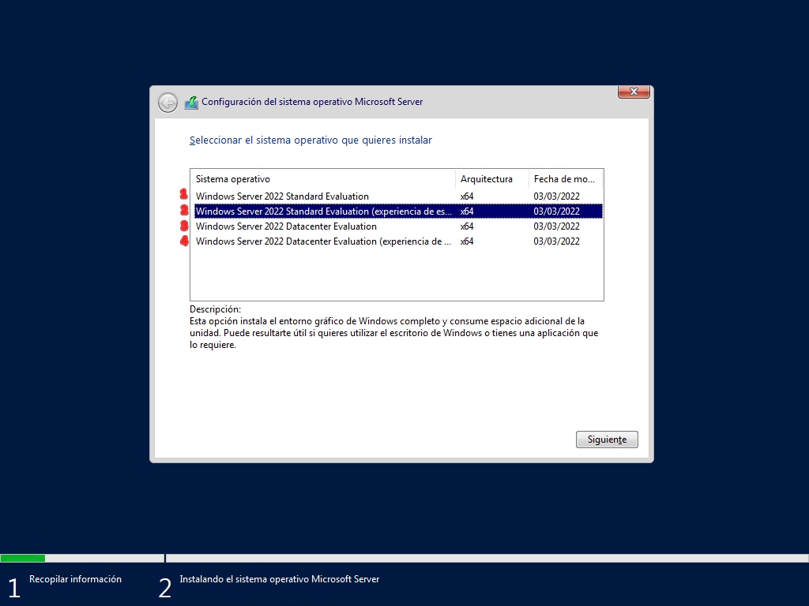
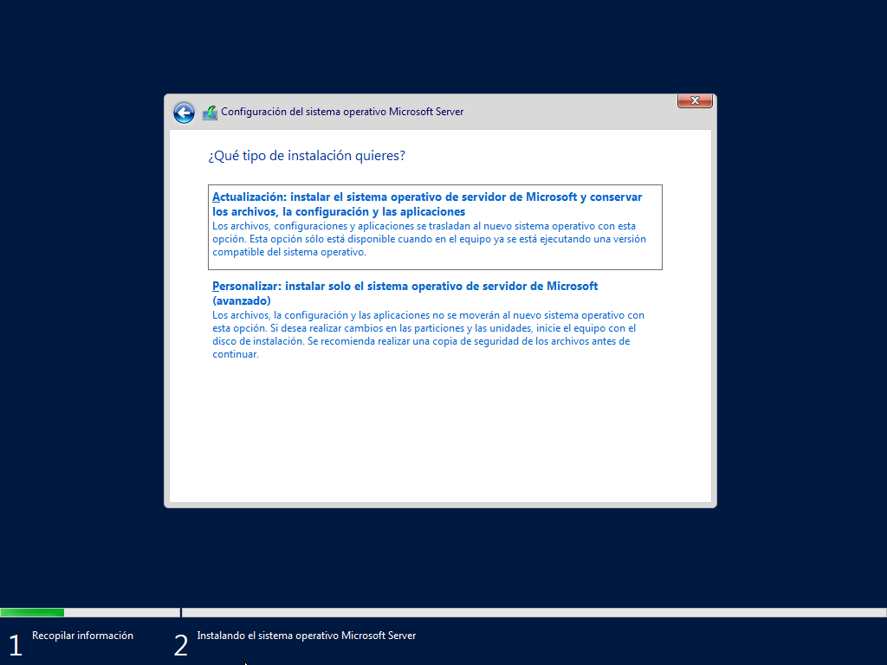
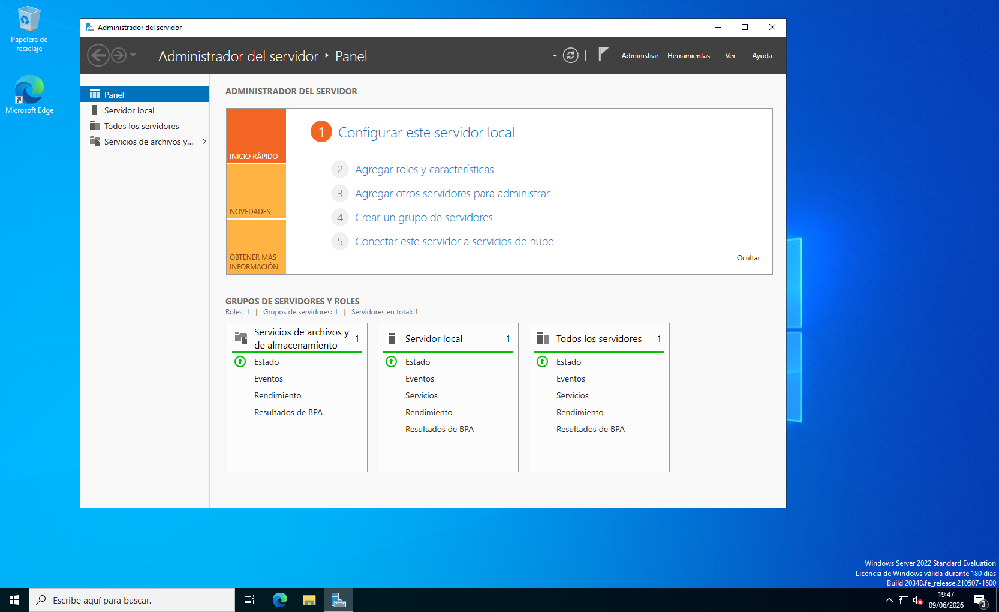

# 01 — Instalación de Windows Server 2022

## Descripción
Instalación limpia de Windows Server 2022 Standard Evaluation
en entorno virtualizado con VirtualBox como base del laboratorio
de Active Directory.

## Entorno
- Hipervisor: Oracle VirtualBox 7.2.8
- ISO: Windows Server 2022 Standard Evaluation (180 días)
- Nombre de la VM: AD01

## Configuración de la VM

### Hardware asignado
| Parámetro | Valor |
|---|---|
| RAM | 4096 MB |
| CPUs | 3 |
| Disco | 100 GB (dinámico) |

### Orden de arranque
Se configuró el orden de arranque en BIOS de la VM:
1. Óptica (para arrancar desde la ISO)
2. Disco duro
3. Disquete desactivado

## Edición seleccionada
Se instaló **Windows Server 2022 Standard Evaluation
(Experiencia de escritorio)** por las siguientes razones:
- Interfaz gráfica para facilitar la administración
- Edición Standard adecuada para entornos de un único servidor
- La edición Datacenter está orientada a virtualización masiva
  y no es necesaria para este laboratorio

## Tipo de instalación
Se seleccionó **instalación personalizada** (desde cero) en lugar
de actualización, ya que se trata de un entorno nuevo sin sistema
operativo previo.

## Capturas

## Siguiente paso
Post install.
