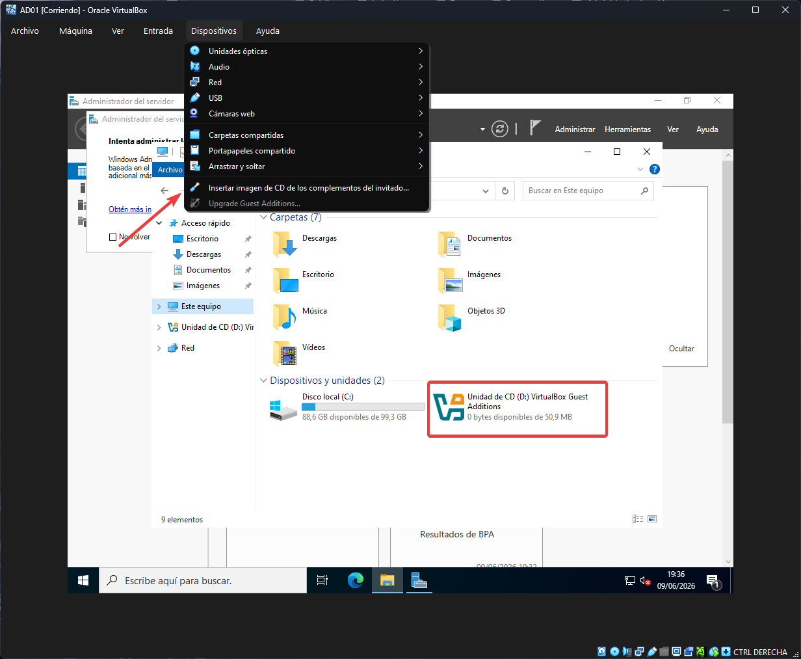
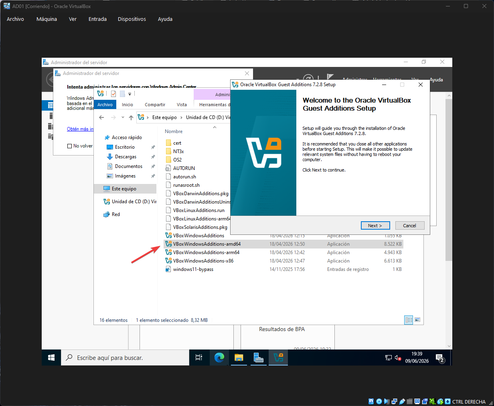
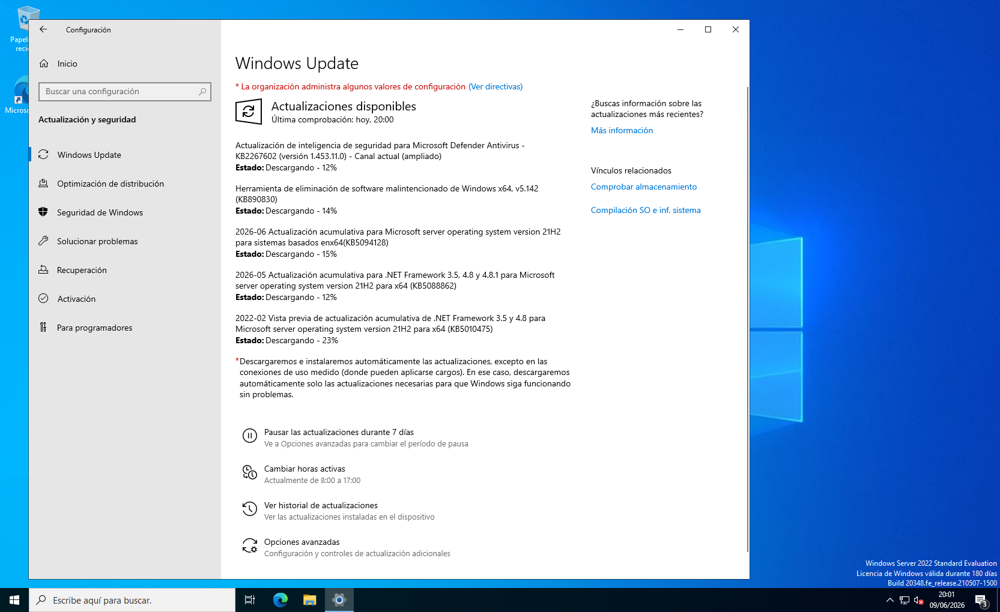
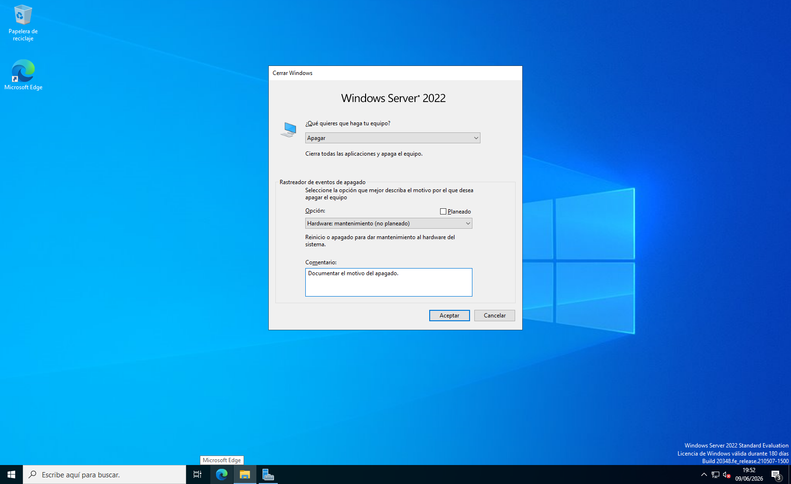

## Post-instalación

### Guest Additions
Se instalaron las VirtualBox Guest Additions para habilitar:
- Resolución de pantalla dinámica
- Portapapeles compartido entre host y VM
- Mejor rendimiento gráfico

### Actualizaciones del sistema
Se aplicaron todas las actualizaciones disponibles mediante
Windows Update para garantizar que el sistema está parcheado
antes de configurar los roles de servidor.

### Rastreador de eventos de apagado
Windows Server registra el motivo de cada apagado o reinicio.
Esto es importante en entornos de producción para mantener
un registro de cambios en el servidor.

## Capturas
 

## Siguiente paso

Tarjetas de red, configuración de redes y IP estatica.
Configuración de IP estática 
